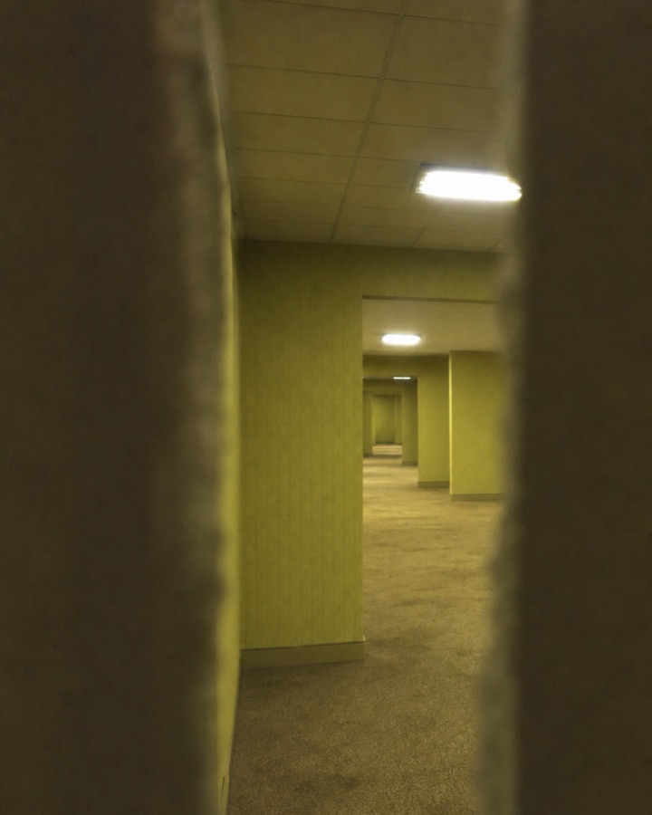
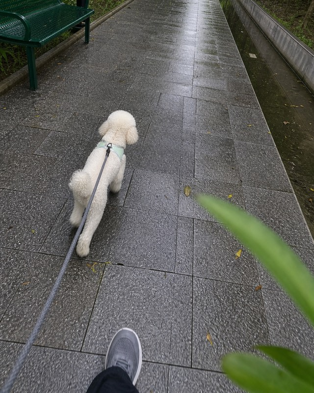

# oh-my-FolkStoryPhoto

一个面向 Codex 的中文民间故事手机伪纪录图文技能。它把传说、怪谈、志怪、地方口述或用户提供的灵感，整理成 24–27 张 4:5 图文轮播，并通过两次人工确认、结构化自审、一次返修上限和发布校验完成交付。

核心原则：每张图首先要像一个真实的人在当时条件下自然拍下并保留的私人照片，其次才承担悬疑、怪谈或奇观叙事。真实感来自拍摄者、拍摄原因、受限机位、人物行为和设备能力，而不是统一噪点、假日期戳或复古滤镜。

## 主要能力

- 区分原典、现代解读、视觉参考、用户强制设定和本篇虚构。
- 建立年代可信的拍摄设备档案与 24–27 图证据链。
- 在文字方案和角色/地点母版后分别等待用户明确确认。
- 逐图记录拍摄来源、拍摄原因、人物意识、受限机位和手机成像结果。
- 对文稿、参考图、单图和整篇相册执行“自审—自动修订—再次验收”。
- 传输阻塞时自动降级参考输入，单项失败后记录并跳过，继续其他可运行图片。
- 参考图支持一次内容返修；正式返修仍保留用户批准门槛和单轮上限。
- 将网络错误、超时、无候选和后端健康告警分离，持久化请求指纹、恢复事务、派生哈希和失败历史。
- 自动创建和滚动生图批次，每 3 张成功或 15 分钟换批，不增加人工确认。
- 校验机器状态与发布清单，输出 1080×1350 PNG 和联系表。
- 提供可选 Codex `Stop` hook，防止在自审或返修尚未完成时提前结束。

## 作品展示

以下是使用本工作流创作的单帧示例。它们展示的是拍摄者位置、偶然遮挡、设备限制和私人相册感，不代表完整项目的全部分镜。

<table>
  <tr>
    <td width="50%" align="center">
      
      <br><strong>阈限空间</strong>：从狭窄遮挡后记录重复空间
    </td>
    <td width="50%" align="center">
      
      <br><strong>桃花源记</strong>：船上调查者回收无人机
    </td>
  </tr>
  <tr>
    <td width="50%" align="center">
      
      <br><strong>狗灾</strong>：雨后遛狗的普通相册基线
    </td>
    <td width="50%" align="center">
      
      <br><strong>香巴拉传说</strong>：用旧照片比对远方城市
    </td>
  </tr>
</table>

这些图片是虚构项目的 AI 辅助创作示例，不是新闻、历史档案或真实异常事件证据。展示图片 © isLiuyx1，仅供项目演示，不包含在本仓库的 MIT 软件许可证中。

## 工作流

```text
drafting
→ text_self_review
→ awaiting_plan_approval
→ reference_self_review
→ awaiting_reference_approval
→ scene_self_review
→ repairing
→ final_self_review
→ complete / needs_user
```

`awaiting_plan_approval`、`awaiting_reference_approval` 和返修报告批准是不可绕过的内容门槛。传输恢复、参考图派生、批次切换和单图跳过不会额外要求用户确认。`Stop` hook 只会提醒 Codex 继续未完成的审查，不会替用户批准方案，也不会增加第二轮返修。

## 仓库结构

```text
.
├── .codex-plugin/plugin.json
├── skills/oh-my-folkstoryphoto/
│   ├── SKILL.md
│   ├── agents/openai.yaml
│   ├── references/
│   └── scripts/
├── hooks/
├── scripts/install_local.py
└── tests/
```

- `skills/oh-my-folkstoryphoto/`：可独立安装的核心技能。
- `references/`：工作流、真实拍摄、视觉语言、自审、验收和输出规范。
- `review_state.py`：校验、迁移和推进结构化审查状态。
- `transport_guard.py`：固定提示词/参考图指纹，管理传输重试、探测和熔断。
- `package_release.py`：校验状态后裁切并打包最终图片。
- `hooks/`：可选 Codex 生命周期 hook。
- `tests/`：状态机、传输保护、hook 和图片打包回归测试。

## 安装

要求 Python 3.10+。图片预检和打包需要 Pillow。

先预览安装目标：

```bash
python3 scripts/install_local.py --mode skill --dry-run
python3 scripts/install_local.py --mode plugin --dry-run
```

只安装核心技能：

```bash
python3 scripts/install_local.py --mode skill
```

安装包含可选 hook 的完整插件：

```bash
python3 scripts/install_local.py --mode plugin
```

安装脚本会在替换旧版本前创建带时间戳的备份。插件安装后，在 Codex 中检查并信任 hook，然后开启一个新任务测试。

## 使用

在 Codex 中调用：

```text
$oh-my-folkstoryphoto 根据这个传说制作一套真实手机相册感的图文：<来源>
```

技能会先输出完整文字方案并等待确认，之后生成角色与地点母版并再次等待确认，最后才逐镜生成、检查、返修和打包。

## 开发与验证

```bash
python3 -m pip install -r requirements-dev.txt
python3 -m unittest discover -s tests -v
```

插件和技能还应使用当前 Codex 安装随附的官方校验器验证。CI 会运行回归测试、Python 语法检查和 JSON 解析检查。

## 发布与内容边界

- 不把网络推测写成历史事实、学术定论或原典唯一解释。
- 不把 AI 图片伪装成真实泄露档案、真实灾难证据或新闻影像。
- 仓库不包含商业 IP、影视角色或完整实践项目素材；仅保留经过筛选和压缩的展示图、匿名化规则与测试样例。
- 自动返修一次后仍不合格的内容必须进入 `needs_user`，不能静默降级为通过。

## 许可证

[MIT](LICENSE) © isliuyx

## 交流讨论

欢迎加入我们的 Telegram 群，交流 Codex 技能、手机伪纪录、民间故事改编和工作流实践：

[加入 Telegram 群聊](https://t.me/+DEqXSdSJrXs1MTc1)
